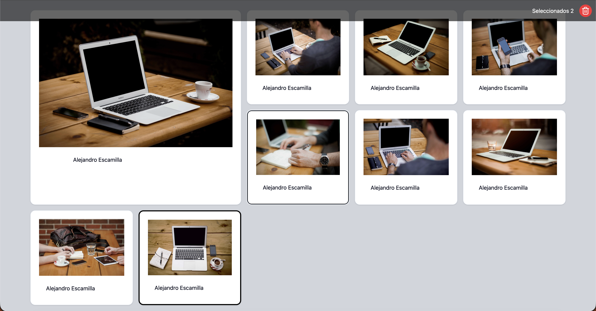
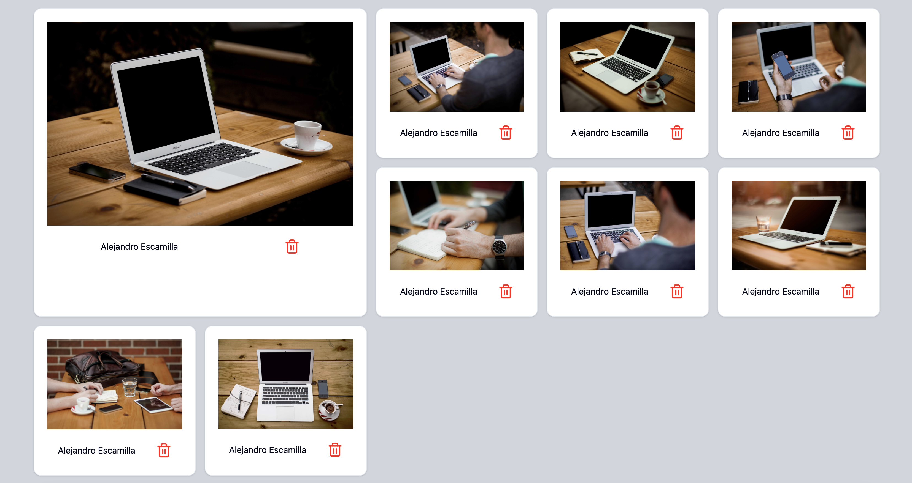

# Image Gallery

Aplicación de galería de imágenes desarrollada con **React + TypeScript + Vite**, que permite visualizar una colección de imágenes, seleccionar una o varias, eliminarlas y reordenarlas mediante **Drag & Drop**.

El proyecto se centra en la correcta **gestión de estado**, la **arquitectura de componentes** y la **actualización reactiva de la UI**.

---




---

## 🚀 Tecnologías usadas

- React: 19.2.0
- TypeScript: 5.9.3
- Vite: 7.2.4
- Tailwind CSS: 4.1.18
- dnd-kit (Drag & Drop): 6.3.
- Vitest: 4.0.16
- Testing Library: 16.3.1

---

## 📸 Funcionalidades

- Visualización de una galería de imágenes
- Imagen destacada (siempre la primera del array)
- Selección individual y múltiple de imágenes
- Eliminación de imágenes con confirmación
- Eliminación múltiple de imágenes seleccionadas
- Reordenación de imágenes mediante Drag & Drop
- Actualización automática de la imagen destacada tras reordenar
- UI accesible y reactiva

---

## 🧱 Arquitectura de la aplicación

La aplicación está dividida en componentes con responsabilidades claras:

### Gallery
- Mantiene el estado principal de la galería
- Gestiona selección, eliminación y reordenación
- Decide qué imagen está destacada

### ImageItem
- Representa una imagen individual
- Aplica estilos según su estado (destacada / seleccionada)
- Comunica eventos al componente padre

La lógica de negocio está separada de la presentación para facilitar el mantenimiento y el testing.

---

## 🖱️ Drag & Drop

La funcionalidad de Drag & Drop está implementada con **dnd-kit**.

Cuando una imagen se arrastra y se suelta sobre otra:

- Se recalcula el orden del array
- Se actualiza el estado de la galería
- La UI se re-renderiza automáticamente
- La imagen destacada cambia si el nuevo orden lo requiere

---

## 📂 Estructura del proyecto

```txt
src/
├── components/
│   ├── Gallery/
        └── Gallery.tsx
        └── Gallery.test.tsx
│   ├── ImageItem/
        └── ImageItems.tsx
        └── ImageItems.test.tsx
├── data/
│   └── dataPhoto.ts
├── utils/
│   └── reorderArray.ts
├── types/
│   └── photo.ts
├── assets/
├── main.tsx
```
## 🛠️ Cómo usar la aplicación

Sigue estos pasos para ejecutar el proyecto en tu entorno local.

---

### 1️⃣ Clonar el repositorio

```bash
git clone https://github.com/josep100/sprint_5_gallery_react.git
```

### 2️⃣ Acceder al directorio del proyecto
```bash
cd tu-repositorio
```

### 3️⃣ Instalar dependencias
```bash
npm install
```

### 4️⃣ Ejecutar la aplicación en desarrollo
```bash
npm run dev
```


